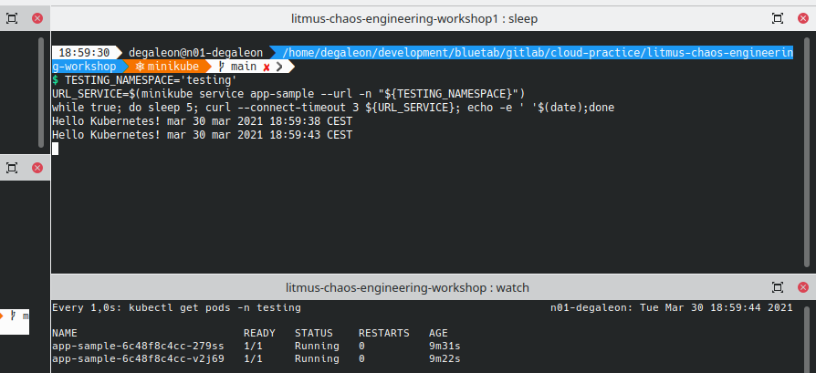

# **Chaos Engineering sobre Kubernetes con Litmus**

- [**Chaos Engineering sobre Kubernetes con Litmus**](#chaos-engineering-sobre-kubernetes-con-litmus)
  - [**Sobre *Chaos Engineering***](#sobre-chaos-engineering)
  - [**Componentes Litmus**](#componentes-litmus)
  - [**Workshop**](#workshop)
    - [**Preparación de consola**](#preparación-de-consola)
    - [**Creación de entorno de pruebas con minikube**](#creación-de-entorno-de-pruebas-con-minikube)
    - [**Creación de namespaces**](#creación-de-namespaces)
    - [**Despliegue de aplicación de test**](#despliegue-de-aplicación-de-test)
    - [**Instalación *Chaos Experiments***](#instalación-chaos-experiments)
    - [**Despliegue servicios monitorización: Prometheus + Grafana**](#despliegue-servicios-monitorización-prometheus--grafana)
    - [**Creación de anotación "litmuschaos"**](#creación-de-anotación-litmuschaos)
    - [**Detalle componetes de un experimento**](#detalle-componetes-de-un-experimento)
      - [**Service Account, Role y RoleBinding**](#service-account-role-y-rolebinding)
      - [**Definición ChaosEngine**](#definición-chaosengine)
        - [**Especificaciones generales**](#especificaciones-generales)
        - [**Especificaciones de componentes**](#especificaciones-de-componentes)
        - [**Especificaciones de pruebas**](#especificaciones-de-pruebas)
    - [**Ejecución de experimentos**](#ejecución-de-experimentos)
      - [**Container Kill**](#container-kill)
      - [**pod-autoscaler**](#pod-autoscaler)
      - [**Pod CPU Hog**](#pod-cpu-hog)
      - [**Pod Memory Hog**](#pod-memory-hog)
    - [**Planificación de experimentos**](#planificación-de-experimentos)
    - [**Litmus UI Portal**](#litmus-ui-portal)
  - [**Guía Litmus para desarrolladores**](#guía-litmus-para-desarrolladores)
  - [***Chaos Engineering* en despliegue Continuo**](#chaos-engineering-en-despliegue-continuo)
  - [**Consideraciones finales**](#consideraciones-finales)
  - [**Sobre el autor**](#sobre-el-autor)
  

## **Sobre *Chaos Engineering***

## **Componentes Litmus**

* **ChaosEngine**
* **ChaosExperiment**
* **ChaosSchedule**
* **ChaosResult**
* **Litmus Probes**

## **Workshop**

### **Preparación de consola**

Recomendamos abrir una consola y crear 4 paneles:

1. Estado del sistema (ejecutar htop)
2. Panel principal (ejecutaremos todo el contenido del workshop)
3. Monitorización de la aplicación
4. Monitorización de recursos kubernetes
   


### **Creación de entorno de pruebas con minikube**

```bash
# install kubectl
curl -Ls "https://dl.k8s.io/release/$(curl -L -s https://dl.k8s.io/release/stable.txt)/bin/linux/amd64/kubectl" --output /tmp/kubectl
sudo install /tmp/kubectl /usr/local/bin/kubectl
kubectl version --client

# install minikube
curl -Ls https://storage.googleapis.com/minikube/releases/latest/minikube-linux-amd64 --output /tmp/minikube-linux-amd64
sudo install /tmp/minikube-linux-amd64 /usr/local/bin/minikube
minikube version

# starting minikube
minikube start --cpus 2 --memory 4096

# enabled ingress & metrics servers
minikube addons enable ingress
minikube addons enable metrics-server

# enabled tunnel & dashboard
minikube tunnel > /dev/null &
minikube dashboard > /dev/null &
```

### **Creación de namespaces**
```bash
# create namespace testing
kubectl apply -f src/base/testing-ns.yaml

# create namespace litmus
kubectl apply -f src/base/litmus-ns.yaml

# create namespace monitoring (prometheus + grafana)
kubectl apply -f src/base/monitoring-ns.yaml

TESTING_NAMESPACE="testing"
LITMUS_NAMESPACE="litmus"
MONITORING_NAMESPACE="monitoring"
```

### **Despliegue de aplicación de test**

Desplegamos una aplicación de test para poder ejecutar los experimentos de litmus.
* **nginx-deployment.yaml**: creación de despliegue "app-sample", con recursos de cpu/memoria "limits"/"request" y configuración de "readinessProbe". Exponemos el servicio en el puerto 8080 a través de un balanceador. 
* **ngix-hpa.yaml**: creación de *Horizontal Pod Autoscaler* (min 2 réplicas / max 10 réplicas)

```bash
# deployment
kubectl apply -f src/nginx/nginx-deployment.yaml --namespace="${TESTING_NAMESPACE}"

# enable hpa
kubectl apply -f src/nginx/ngix-hpa.yaml --namespace="${TESTING_NAMESPACE}"

# expose service 
kubectl expose deployment app-sample --type=LoadBalancer --port=8080  -n "${TESTING_NAMESPACE}"

# get pods
kubectl get pods -n "${TESTING_NAMESPACE}"

NAME                          READY   STATUS    RESTARTS   AGE
app-sample-7ff489dbd5-82ppw   1/1     Running   0          45m
app-sample-7ff489dbd5-jg9vh   1/1     Running   0          45m
```

:information_source: En el panel 3 ejecutar el siguiente código para recibir la respuesta de la aplicación. 
```bash
TESTING_NAMESPACE='testing'
URL_SERVICE=$(minikube service app-sample --url -n "${TESTING_NAMESPACE}")
while true; do sleep 5; curl --connect-timeout 3 ${URL_SERVICE}; echo -e ' '$(date);done
```



### **Instalación *Chaos Experiments***

```bash
# litmus operator & experiments
kubectl apply -f https://litmuschaos.github.io/litmus/litmus-operator-v1.13.0.yaml -n "${LITMUS_NAMESPACE}"

kubectl apply -f https://hub.litmuschaos.io/api/chaos/1.13.0\?file\=charts/generic/experiments.yaml -n "${TESTING_NAMESPACE}"
```

```bash
kubectl get chaosexperiments -n "${TESTING_NAMESPACE}"

NAME                      AGE
container-kill            6s
disk-fill                 6s
disk-loss                 6s
docker-service-kill       6s
k8-pod-delete             6s
k8-service-kill           6s
kubelet-service-kill      6s
node-cpu-hog              6s
node-drain                6s
node-io-stress            6s
node-memory-hog           6s
node-poweroff             6s
node-restart              6s
node-taint                6s
pod-autoscaler            6s
pod-cpu-hog               6s
pod-delete                6s
pod-io-stress             6s
pod-memory-hog            6s
pod-network-corruption    6s
pod-network-duplication   6s
pod-network-latency       6s
pod-network-loss          6s
```

### **Despliegue servicios monitorización: Prometheus + Grafana**

```bash
# create namespace litmus
kubectl -n ${MONITORING_NAMESPACE} apply -f src/litmus/monitoring/utils/prometheus/prometheus-operator/

kubectl -n ${MONITORING_NAMESPACE} apply -f src/litmus/monitoring/utils/metrics-exporters-with-service-monitors/node-exporter/

kubectl -n ${MONITORING_NAMESPACE} apply -f src/litmus/monitoring/utils/metrics-exporters-with-service-monitors/kube-state-metrics/

kubectl -n ${MONITORING_NAMESPACE} apply -f src/litmus/monitoring/utils/alert-manager-with-service-monitor/

kubectl -n ${LITMUS_NAMESPACE} apply -f src/litmus/monitoring/utils/metrics-exporters-with-service-monitors/litmus-metrics/chaos-exporter/

kubectl -n ${MONITORING_NAMESPACE} apply -f src/litmus/monitoring/utils/prometheus/prometheus-configuration/

kubectl -n ${MONITORING_NAMESPACE} apply -f src/litmus/monitoring/utils/grafana/

minikube service grafana -n ${MONITORING_NAMESPACE} > /dev/null &
```

### **Creación de anotación "litmuschaos"**

Ya tenemos todos los componentes de litmus desplegados. 

```bash
# add annotate (enable chaos)
kubectl annotate deploy/app-sample litmuschaos.io/chaos="true" -n "${TESTING_NAMESPACE}"
``` 

```bash
kubectl describe deploy/app-sample -n "${TESTING_NAMESPACE}"

Name:                   app-sample
Namespace:              testing
CreationTimestamp:      Mon, 29 Mar 2021 09:35:53 +0200
Labels:                 app=app-sample
                        app.kubernetes.io/name=app-sample
Annotations:            deployment.kubernetes.io/revision: 1
                        litmuschaos.io/chaos: true # <-- HABILITAMOS EXPERIMENTOS
Selector:               app.kubernetes.io/name=app-sample
Replicas:               2 desired | 2 updated | 2 total | 2 available | 0 unavailable
StrategyType:           RollingUpdate
```

### **Detalle componetes de un experimento**

#### **Service Account, Role y RoleBinding**

Cada experimento debe tener asociado un ServiceAccount, un Role para definir permisos y un RoleBinding para relacionar el ServiceAccount/Role.

Podéis encontrar todas las definiciones dentro de *src/litmus/nombre-experimento/nombre-experimento-sa.yaml*

```yaml
apiVersion: v1
kind: ServiceAccount
metadata:
  name: container-kill-sa
  namespace: testing
  labels:
    name: container-kill-sa
    app.kubernetes.io/part-of: litmus
---
apiVersion: rbac.authorization.k8s.io/v1
kind: Role
metadata:
  name: container-kill-sa
  namespace: testing
  labels:
    name: container-kill-sa
    app.kubernetes.io/part-of: litmus
rules:
  - apiGroups: [""]
    resources:
      ["pods", "pods/exec", "pods/log", "events", "replicationcontrollers"]
    verbs:
      ["create", "list", "get", "patch", "update", "delete", "deletecollection"]
  - apiGroups: ["batch"]
    resources: ["jobs"]
    verbs: ["create", "list", "get", "delete", "deletecollection"]
  - apiGroups: ["apps"]
    resources: ["deployments", "statefulsets", "daemonsets", "replicasets"]
    verbs: ["list", "get"]
  - apiGroups: ["apps.openshift.io"]
    resources: ["deploymentconfigs"]
    verbs: ["list", "get"]
  - apiGroups: ["argoproj.io"]
    resources: ["rollouts"]
    verbs: ["list", "get"]
  - apiGroups: ["litmuschaos.io"]
    resources: ["chaosengines", "chaosexperiments", "chaosresults"]
    verbs: ["create", "list", "get", "patch", "update"]
---
apiVersion: rbac.authorization.k8s.io/v1
kind: RoleBinding
metadata:
  name: container-kill-sa
  namespace: testing
  labels:
    name: container-kill-sa
    app.kubernetes.io/part-of: litmus
roleRef:
  apiGroup: rbac.authorization.k8s.io
  kind: Role
  name: container-kill-sa
subjects:
  - kind: ServiceAccount
    name: container-kill-sa
    namespace: testing
```

#### **Definición ChaosEngine**

Para facilitar la comprensión, hemos dividido en 3 secciones el contenido de un experimiento. Podéis encontrar todas las definiciones dentro de *src/litmus/nombre-experimento/chaos-engine-*.yaml*


##### **Especificaciones generales**

En esta sección especificaremos atributos comunes a todos los experimentos. Para este workshop, debido a que estamos realizando los experimentos contra un único deployment, el único atributo que cambiará entre experimentos es "chaosServiceAccount".

```yaml
apiVersion: litmuschaos.io/v1alpha1
kind: ChaosEngine
metadata:
  name: app-sample-chaos # Nombre del chaos-engine
  namespace: testing     # Namespace de testing
spec:
  annotationCheck: "true" # Hemos creado una anotación en nuestro deployment app-sample. Con la propiedad marcada a "true" indicamos que aplicarmeos el experimento a este despliegue.

  engineState: "active"   # Activación/desactivación de experimento

  appinfo:                # En esta sección proporcionamos la información de nuestro deployment.
    appns: "testing"      # Namespace donde se localiza
    applabel: "app.kubernetes.io/name=app-sample" # Etiqueta asociada a nuestro deployment
    appkind: "deployment" # Tipo de recurso (sólo admite deployment, lo que afectará a todos los pods)

  chaosServiceAccount: container-kill-sa # Nombre del service account (creado en el paso anterior)
  monitoring: true       # si queremos activar la monitorización (prometheus o similares)
  jobCleanUpPolicy: "delete" # Permite controlar la limpieza de recursos tras la ejecución. Especificar "retain" para debug.
```

##### **Especificaciones de componentes**
En esta sección definiremos las variables de entorno propias de cada experimento. Las variables "CHAOS_INTERVAL" y "TOTAL_CHAOS_DURATION" son comunes a todos los experimentos.
```yaml
  experiments:
    - name: container-kill # Nombre del experimento
      spec:
        components:
          env:
            # Intervalo (segundos) por cada iteración
            - name: CHAOS_INTERVAL
              value: "10"

            # Tiempo total (segundos) que durará el experimento
            - name: TOTAL_CHAOS_DURATION
              value: "60"
``` 

##### **Especificaciones de pruebas**
En esta sección se informan los atributos para las pruebs de validación. El resultado del experiment dependerá del cumplimiento de la validación especificada. 

En el siguiente [enlace](https://docs.litmuschaos.io/docs/litmus-probe/) podréis consultar los tipo de pruebas disponibles.

```yaml
        probe:
          - name: "check-frontend-access-url" # Nombre de prueba
            type: "httpProbe"                 # Petición de tipo HTTP(S). Alternativas: cmdProbe, k8sProbe, promProbe.
            httpProbe/inputs:                  
              url: "http://app-sample.testing.svc.cluster.local:8080" # URL a validar
              insecureSkipVerify: false                               # Permitir HTTP sin TLS
              method:
                get:                          # Petición tipo GET
                  criteria: ==                # Criterio a evaluar
                  responseCode: "200"         # Respuesta a evaluar
            mode: "Continuous"                # La prueba se ejecuta de forma continua (alternativas: SoT, EoT, Edge, OnChaos)
            runProperties:
              probeTimeout: 5                 # Número de segundos para timeout en la petición
              interval: 5                     # Intervalo (segundos) entre re-intentos
              retry: 1                        # Número de re-intento antes de dar por fallida la validación   
              probePollingInterval: 2         # Intervalo (segundos) entre peticiones

```

### **Ejecución de experimentos**

#### **Container Kill**

- **Descripción:** Aborta la ejecución del servicio docker dentro de un pod. La selección del pod es aleatoria.

- **Información oficial del experimento:** [enlace](https://docs.litmuschaos.io/docs/container-kill/)
  
- **Criterio de entrada:** 2 pods de app-sample en estado "Running"
  
  ```bash
    kubectl get pods -n "${TESTING_NAMESPACE}"

    NAME                          READY   STATUS    RESTARTS   AGE
    app-sample-7ff489dbd5-82ppw   1/1     Running   0          9h
    app-sample-7ff489dbd5-jg9vh   1/1     Running   0          9h
  ```

- **Parámetros de entrada experimento:**

    ```yaml
    experiments:
        - name: container-kill
        spec:
            components:
            env:
                # provide the chaos interval
                - name: CHAOS_INTERVAL
                value: "10"

                # provide the total chaos duration
                - name: TOTAL_CHAOS_DURATION
                value: "20"

                - name: CONTAINER_RUNTIME
                value: "docker"

                - name: SOCKET_PATH
                value: "/var/run/docker.sock"
    ```

- **Hipótesis:** Tenemos dos pods escuchando por el 8080 tras un balanceador. Nuestro deployment tiene readinessProbe con periodSeconds=1 y failureThreshold=1. Si uno de los pods deja de responder, el balanceador deja de enviar tráfico a ese pod y debe responder el otro. Hemos establecido el healthcheck del experimento cada 5s (tiempo máximo de respuesta aceptable) atacando directamente contra el balanceador, por lo que no deberíamos de tener pérdida de servicio en ningún momento. 

- **Creación de SA, Role y RoleBinding**

    ```bash
    kubectl apply -f src/litmus/kill-container/kill-container-sa.yaml -n "${TESTING_NAMESPACE}"
    ```

- **Ejecución de experimento**

    ```bash
    kubectl apply -f src/litmus/kill-container/chaos-engine-kill-container.yaml  -n "${TESTING_NAMESPACE}"
    
    # Awaited -> Pass/Fail
    watch -n 1 kubectl get chaosresult app-sample-chaos-container-kill -n "${TESTING_NAMESPACE}" -o jsonpath="{.status.experimentstatus.verdict}"
    ```

- **Observaciones:** durante el experimento observamos 2 reinicios de pod con transición "Running" -> "Error" -> "Running". 

- **Validación:** Peticiones get al balanceador con respuesta 200.

    ```yaml
    probe:
    - name: "check-frontend-access-url"
        type: "httpProbe"
        httpProbe/inputs:
        url: "http://app-sample.testing.svc.cluster.local:8080"
        insecureSkipVerify: false
        method:
            get:
            criteria: ==
            responseCode: "200"
        mode: "Continuous"
        runProperties:
        probeTimeout: 5
        interval: 5
        retry: 1
        probePollingInterval: 2
    ```

- **Resultado:** resultado "Pass" (dos pods en estado "Running", sin pérdida de servicio durante la duración del experimento)

    ```bash
    $ kubectl describe chaosresult app-sample-chaos-container-kill -n "${TESTING_NAMESPACE}" 

    Spec:
        Engine:      app-sample-chaos
        Experiment:  container-kill
    Status:
        Experimentstatus:
            Fail Step:                 N/A
            Phase:                     Completed
            Probe Success Percentage:  100
            Verdict:                   Pass
    History:
        Failed Runs:   0
        Passed Runs:   6
        Stopped Runs:  0
    Probe Status:
        Name:  check-frontend-access-url
        Status:
            Continuous:  Passed 👍
        Type:            httpProbe
    Events:
        Type    Reason   Age    From                         Message
        ----    ------   ----   ----                         -------
        Normal  Awaited  3m52s  container-kill-fs68ut-p9ps7  experiment: container-kill, Result: Awaited
        Normal  Pass     2m7s   container-kill-fs68ut-p9ps7  experiment: container-kill, Result: Pass
    
    
    $ kubectl get pods -n testing
    
    NAME                          READY   STATUS    RESTARTS   AGE
    app-sample-7ff489dbd5-82ppw   1/1     Running   2          9h
    app-sample-7ff489dbd5-jg9vh   1/1     Running   0          9h
    ```


#### **pod-autoscaler**

- **Descripción:** permite escalar las réplicas para testear el autoescalado en el nodo.

- **Información oficial del experimento:** [enlace](https://docs.litmuschaos.io/docs/pod-autoscaler/)
  
- **Criterio de entrada:** 2 pods de app-sample en estado "Running"
  
  ```bash
    kubectl get pods -n "${TESTING_NAMESPACE}"

  ```

- **Parámetros de entrada experimento:**

    ```yaml
    ```

- **Hipótesis:** Tenemos dos pods escuchando por el 8080 tras un balanceador. Nuestro deployment tiene readinessProbe con periodSeconds=1 y failureThreshold=1. Si uno de los pods deja de responder, el balanceador deja de enviar tráfico a ese pod y debe responder el otro. Hemos establecido el healthcheck del experimento cada 5s (tiempo máximo de respuesta aceptable) atacando directamente contra el balanceador, por lo que no deberíamos de tener pérdida de servicio en ningún momento. 

- **Creación de SA, Role y RoleBinding**

    ```bash
    
    ```

- **Ejecución de experimento**

    ```bash
    ```

- **Observaciones:**

- **Validación:** Peticiones get al balanceador con respuesta 200.

    ```yaml
    probe:
    - name: "check-frontend-access-url"
        type: "httpProbe"
        httpProbe/inputs:
        url: "http://app-sample.testing.svc.cluster.local:8080"
        insecureSkipVerify: false
        method:
            get:
            criteria: ==
            responseCode: "200"
        mode: "Continuous"
        runProperties:
        probeTimeout: 5
        interval: 5
        retry: 1
        probePollingInterval: 2
    ```

- **Resultado:** resultado "Pass" (dos pods en estado "Running", sin pérdida de servicio durante la duración del experimento)

    ```bash
    $ kubectl describe chaosresult app-sample-chaos-container-kill -n "${TESTING_NAMESPACE}" 

    $ kubectl get pods -n testing
    
    ```

#### **Pod CPU Hog**

- **Descripción:**

- **Información oficial del experimento:** [enlace](https://docs.litmuschaos.io/docs/pod-memory-hog/)
  
- **Criterio de entrada:** 2 pods de app-sample en estado "Running"
  
  ```bash
    kubectl get pods -n "${TESTING_NAMESPACE}"

  ```

- **Parámetros de entrada experimento:**

    ```yaml
    ```

- **Hipótesis:** Tenemos dos pods escuchando por el 8080 tras un balanceador. Nuestro deployment tiene readinessProbe con periodSeconds=1 y failureThreshold=1. Si uno de los pods deja de responder, el balanceador deja de enviar tráfico a ese pod y debe responder el otro. Hemos establecido el healthcheck del experimento cada 5s (tiempo máximo de respuesta aceptable) atacando directamente contra el balanceador, por lo que no deberíamos de tener pérdida de servicio en ningún momento. 

- **Creación de SA, Role y RoleBinding**

    ```bash
    
    ```

- **Ejecución de experimento**

    ```bash
    ```

- **Observaciones:**

- **Validación:** Peticiones get al balanceador con respuesta 200.

    ```yaml
    probe:
    - name: "check-frontend-access-url"
        type: "httpProbe"
        httpProbe/inputs:
        url: "http://app-sample.testing.svc.cluster.local:8080"
        insecureSkipVerify: false
        method:
            get:
            criteria: ==
            responseCode: "200"
        mode: "Continuous"
        runProperties:
        probeTimeout: 5
        interval: 5
        retry: 1
        probePollingInterval: 2
    ```

- **Resultado:** resultado "Pass" (dos pods en estado "Running", sin pérdida de servicio durante la duración del experimento)

    ```bash
    $ kubectl describe chaosresult app-sample-chaos-container-kill -n "${TESTING_NAMESPACE}" 

    $ kubectl get pods -n testing
    
    ```

#### **Pod Memory Hog**

- **Descripción:**

- **Información oficial del experimento:** [enlace](https://docs.litmuschaos.io/docs/pod-memory-hog/)
  
- **Criterio de entrada:** 2 pods de app-sample en estado "Running"
  
  ```bash
    kubectl get pods -n "${TESTING_NAMESPACE}"

  ```

- **Parámetros de entrada experimento:**

    ```yaml
    ```

- **Hipótesis:** Tenemos dos pods escuchando por el 8080 tras un balanceador. Nuestro deployment tiene readinessProbe con periodSeconds=1 y failureThreshold=1. Si uno de los pods deja de responder, el balanceador deja de enviar tráfico a ese pod y debe responder el otro. Hemos establecido el healthcheck del experimento cada 5s (tiempo máximo de respuesta aceptable) atacando directamente contra el balanceador, por lo que no deberíamos de tener pérdida de servicio en ningún momento. 

- **Creación de SA, Role y RoleBinding**

    ```bash
    
    ```

- **Ejecución de experimento**

    ```bash
    ```

- **Observaciones:**

- **Validación:** Peticiones get al balanceador con respuesta 200.

    ```yaml
    probe:
    - name: "check-frontend-access-url"
        type: "httpProbe"
        httpProbe/inputs:
        url: "http://app-sample.testing.svc.cluster.local:8080"
        insecureSkipVerify: false
        method:
            get:
            criteria: ==
            responseCode: "200"
        mode: "Continuous"
        runProperties:
        probeTimeout: 5
        interval: 5
        retry: 1
        probePollingInterval: 2
    ```

- **Resultado:** resultado "Pass" (dos pods en estado "Running", sin pérdida de servicio durante la duración del experimento)

    ```bash
    $ kubectl describe chaosresult app-sample-chaos-container-kill -n "${TESTING_NAMESPACE}" 

    $ kubectl get pods -n testing
    
    ```

### **Planificación de experimentos**

### **Litmus UI Portal**

Litmus dispone de un portal para poder realizar experimentos sin necesidad utilizar la consola. Dispone de las siguientes funcionalidades:

- Gestión de workflows: dispone de todos los experimentos pre-cargados listos para ejecutar en tu k8s.
- MyHubs: permite conectar a repositorios públicos/privados para hacer uso de tus propios experimentos.
- Analytics: permite visualizar las ejecuciones de tus experimentos, así como estadísticas sobre los mismos. Además, permite conectar a otros DataSources como Prometheus.
- Gestión de equipos y usuarios. 


```bash
# install litmus portal
kubectl apply -f src/litmus/portal/portal.yaml

# kubectl apply -f src/litmus/portal.yaml
minikube service litmusportal-frontend-service -n  ${LITMUS_NAMESPACE} > /dev/null &
```


## **Guía Litmus para desarrolladores** 

En la actualidad, litmus dispone de 48 experimentos a través de [Litmus ChaosHub](https://hub.litmuschaos.io/). Están desarrollados principalmente en Go, aunque disponen de una SDK para python y ansible. 

Los experimentos tienen una estructura bien definida (pre-checks, chaos-injection, litmus-probes, post-checks y result-updates) y es viable desarrollar experimentos que se ajusten a tus necesidades. 

En este [enlace](https://docs.litmuschaos.io/docs/devguide/) encontraréis toda la información para desarrolladores.


## ***Chaos Engineering* en despliegue Continuo**

En este workshop 

## **Consideraciones finales** 

Elaborar un plan de pruebas que te permita conocer el comportamiento íntegro de tu sistema puede ser una tarea relativamente compleja.En este workshop hemos trabajado la inyección de errores en kubernetes utilizando un único servicio bajo un único nodo, pero los sistemas distribuidos suelen ser mucho más complejos: decenas de microservicios ejecutando en múltiples nodos de k8s sobre infraestructura cloud, con alta disponibilidad implementada con multi-AZ/multi-region, comunicaciones con on-premise, etc.


## **Sobre el autor**


  