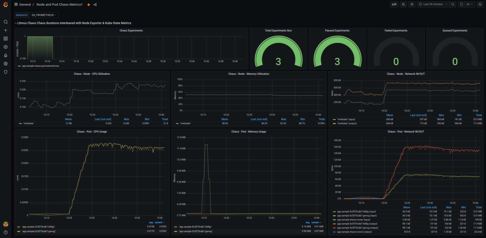
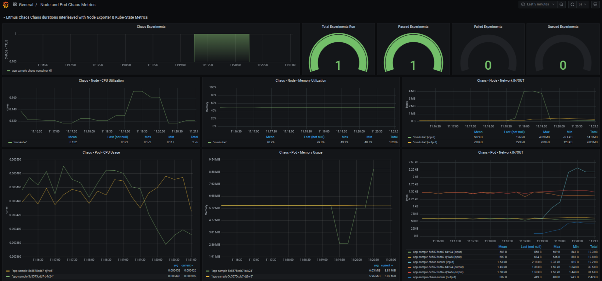
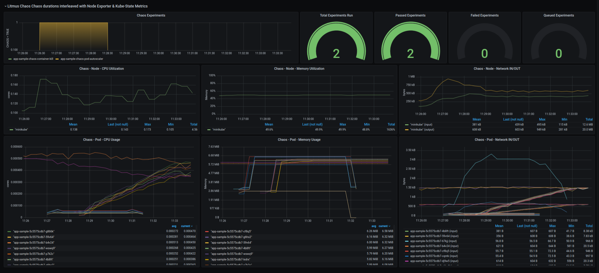
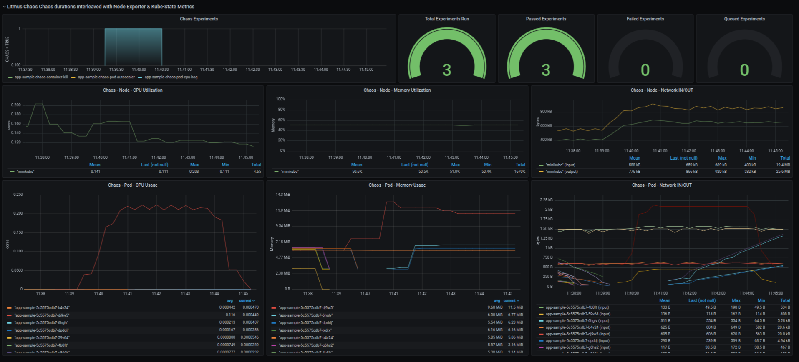

# **Workshop *Chaos Engineering* sobre Kubernetes con Litmus**


- [**Workshop *Chaos Engineering* sobre Kubernetes con Litmus**](#workshop-chaos-engineering-sobre-kubernetes-con-litmus)
    - [**Introducción**](#introducción)
    - [**Objetivos del workshop**](#objetivos-del-workshop)
    - [**Preparación de consola**](#preparación-de-consola)
    - [**Clonación de repositorio**](#clonación-de-repositorio)
    - [**Creación de entorno de pruebas K8s con minikube**](#creación-de-entorno-de-pruebas-k8s-con-minikube)
    - [**Creación de namespaces K8s**](#creación-de-namespaces-k8s)
    - [**Despliegue de aplicación de test**](#despliegue-de-aplicación-de-test)
    - [**Instalación *Chaos Experiments***](#instalación-chaos-experiments)
    - [**Despliegue servicios monitorización: Prometheus + Grafana**](#despliegue-servicios-monitorización-prometheus--grafana)
    - [**Creación de anotación "litmuschaos"**](#creación-de-anotación-litmuschaos)
    - [**Detalle componentes de un experimento**](#detalle-componentes-de-un-experimento)
      - [**Service Account, Role y RoleBinding**](#service-account-role-y-rolebinding)
      - [**Definición ChaosEngine**](#definición-chaosengine)
        - [**Especificaciones generales**](#especificaciones-generales)
        - [**Especificaciones de componentes**](#especificaciones-de-componentes)
        - [**Especificaciones de pruebas**](#especificaciones-de-pruebas)
        - [**Gestión de experimentos**](#gestión-de-experimentos)
    - [**Ejecución de experimentos**](#ejecución-de-experimentos)
      - [**Container Kill**](#container-kill)
      - [**Pod autoscaler**](#pod-autoscaler)
      - [**Pod CPU Hog**](#pod-cpu-hog)
      - [**Extra - Otros experimentos**](#extra---otros-experimentos)
    - [**Planificación de experimentos**](#planificación-de-experimentos)
    - [**LitmusChaos + *Load Test Performance* con Apache Jmeter**](#litmuschaos--load-test-performance-con-apache-jmeter)
  - [**Litmus UI Portal**](#litmus-ui-portal)
  - [**Guía Litmus para desarrolladores**](#guía-litmus-para-desarrolladores)
  - [**Consideraciones finales**](#consideraciones-finales)
  - [**Referencias**](#referencias)
  - [**Licencia**](#licencia)
  - [**Autor**](#autor)
  


### **Introducción**

LitmusChaos nace con el objetivo de ayudar a los desarrolladores y SRE (Site reliability engineering ) de Kubernetes a mejorar la resiliencia de sus aplicaciones/plataformas proporcionando un marco de trabajo completo. Sus principales ventajas respecto a otras herramientas son:

- Experimentos declarativos mediante K8S CRDs (Custom Resource Definition).
- Múltiples experimentos predefinidos.
- SDK en Go/Python/Ansible para desarrollar tus propios experimentos.
  
El producto está liberado bajo licencia Apache-2.0, dispone de una amplia comunidad de desarrolladores y desde 2020 pertenece a Cloud Native Computing Foundation.

### **Objetivos del workshop**

1. Conocer los principales componentes de un experimento y realizar su despliegue
2. Analizar detalladamente la ejecución de tres experimentos (criterios de entrada, hipótesis, observaciones y resultados)
3. Ver las múltiples opciones referentes a planificación de experimentos.
4. Visualizar los resultados mediante Prometheus/Grafana.
5. Analizar un caso de pruebas de resiliencia + test de rendimiento con JMeter.
6. Principales funcionalidades de Litmus UI Portal

### **Preparación de consola**

Recomendamos abrir una consola y crear 4 paneles:

1. Panel principal (ejecutaremos todo el contenido del workshop)
2. Monitorización de la aplicación de test
3. Monitorización de pods
4. Monitorización de eventos
   


### **Clonación de repositorio**

```bash
git clone git@github.com:angelmaroco/litmus-chaos-engineering-workshop.git
cd litmus-chaos-engineering-workshop
```

### **Creación de entorno de pruebas K8s con minikube**

Para este workshop vamos a utilizar minikube pero Litmus puede ser desplegado en cualquier servicio gestionado tipo EKS/AKS/GKE.

```bash
# install kubectl
curl -Ls "https://dl.k8s.io/release/$(curl -L -s https://dl.k8s.io/release/stable.txt)/bin/linux/amd64/kubectl" --output /tmp/kubectl
sudo install /tmp/kubectl /usr/local/bin/kubectl
kubectl version --client

# install minikube
curl -Ls https://storage.googleapis.com/minikube/releases/latest/minikube-linux-amd64 --output /tmp/minikube-linux-amd64
sudo install /tmp/minikube-linux-amd64 /usr/local/bin/minikube
minikube version

# starting minikube
minikube start --cpus 2 --memory 4096

# enabled ingress & metrics servers
minikube addons enable ingress
minikube addons enable metrics-server

# enabled tunnel & dashboard
minikube tunnel > /dev/null &
minikube dashboard > /dev/null &
```

### **Creación de namespaces K8s**
```bash
# create namespace testing
kubectl apply -f src/base/testing-ns.yaml

# create namespace litmus
kubectl apply -f src/base/litmus-ns.yaml

# create namespace monitoring (prometheus + grafana)
kubectl apply -f src/base/monitoring-ns.yaml

TESTING_NAMESPACE="testing"
LITMUS_NAMESPACE="litmus"
MONITORING_NAMESPACE="monitoring"
```

### **Despliegue de aplicación de test**

Desplegamos una aplicación de test para poder ejecutar los experimentos de litmus.
* **nginx-deployment.yaml**: creación de despliegue "app-sample", con recursos de cpu/memoria "limits"/"request" y configuración de "readinessProbe". Exponemos el servicio en el puerto 80 a través de un balanceador. 
* **nginx-hpa.yaml**: creación de *Horizontal Pod Autoscaler* (min 2 réplicas / max 10 réplicas)

```bash
# deployment
kubectl apply -f src/nginx/nginx-deployment.yaml --namespace="${TESTING_NAMESPACE}"

# enable hpa
kubectl apply -f src/nginx/nginx-hpa.yaml --namespace="${TESTING_NAMESPACE}"

# expose service 
kubectl expose deployment app-sample --type=LoadBalancer --port=80  -n "${TESTING_NAMESPACE}"

# wait deployment
kubectl wait --for=condition=available --timeout=60s deployment/app-sample -n "${TESTING_NAMESPACE}"

# get pods
kubectl get pods -n "${TESTING_NAMESPACE}"

#-----------------------------------------

NAME                          READY   STATUS    RESTARTS   AGE
app-sample-7ff489dbd5-82ppw   1/1     Running   0          45m
app-sample-7ff489dbd5-jg9vh   1/1     Running   0          45m

# get service
kubectl get services -n "${TESTING_NAMESPACE}"

# -----------------------------------------

NAME         TYPE           CLUSTER-IP       EXTERNAL-IP      PORT(S)        AGE
app-sample   LoadBalancer   10.109.196.239   10.109.196.239   80:30020/TCP   3m54s

```

:information_source: En **PANEL 2** ejecutar: 
```bash
TESTING_NAMESPACE='testing'
URL_SERVICE=$(minikube service app-sample --url -n "${TESTING_NAMESPACE}")
while true; do sleep 5; curl --connect-timeout 2 -s -o /dev/null -w "Response code %{http_code}"  ${URL_SERVICE}; echo -e ' - '$(date);done

```

:information_source: En **PANEL 3** ejecutar: 
```bash
TESTING_NAMESPACE='testing'
watch -n 1 kubectl get pods -n "${TESTING_NAMESPACE}"
```

:information_source: En **PANEL 4** ejecutar: 
```bash
kubectl get events -A -w
```

### **Instalación *Chaos Experiments***

```bash
# litmus operator & experiments
kubectl apply -f https://litmuschaos.github.io/litmus/litmus-operator-v1.13.0.yaml -n "${LITMUS_NAMESPACE}"

kubectl apply -f https://hub.litmuschaos.io/api/chaos/1.13.0\?file\=charts/generic/experiments.yaml -n "${TESTING_NAMESPACE}"
```

```bash
kubectl get chaosexperiments -n "${TESTING_NAMESPACE}"

# ----------------------------------------------------

NAME                      AGE
container-kill            6s
disk-fill                 6s
disk-loss                 6s
docker-service-kill       6s
k8-pod-delete             6s
k8-service-kill           6s
kubelet-service-kill      6s
node-cpu-hog              6s
node-drain                6s
node-io-stress            6s
node-memory-hog           6s
node-poweroff             6s
node-restart              6s
node-taint                6s
pod-autoscaler            6s
pod-cpu-hog               6s
pod-delete                6s
pod-io-stress             6s
pod-memory-hog            6s
pod-network-corruption    6s
pod-network-duplication   6s
pod-network-latency       6s
pod-network-loss          6s
```

### **Despliegue servicios monitorización: Prometheus + Grafana**

Litmus permite exportar las métricas de los experimentos a Prometheus a través de *chaos-exporter*.

```bash
kubectl -n ${MONITORING_NAMESPACE} apply -f src/litmus/monitoring/utils/prometheus/prometheus-operator/

kubectl -n ${MONITORING_NAMESPACE} apply -f src/litmus/monitoring/utils/metrics-exporters-with-service-monitors/node-exporter/

kubectl -n ${MONITORING_NAMESPACE} apply -f src/litmus/monitoring/utils/metrics-exporters-with-service-monitors/kube-state-metrics/

kubectl -n ${MONITORING_NAMESPACE} apply -f src/litmus/monitoring/utils/alert-manager-with-service-monitor/

kubectl -n ${LITMUS_NAMESPACE} apply -f src/litmus/monitoring/utils/metrics-exporters-with-service-monitors/litmus-metrics/chaos-exporter/

kubectl -n ${MONITORING_NAMESPACE} apply -f src/litmus/monitoring/utils/prometheus/prometheus-configuration/

kubectl -n ${MONITORING_NAMESPACE} apply -f src/litmus/monitoring/utils/grafana/

# wait deployment
kubectl wait --for=condition=available --timeout=60s deployment/grafana -n ${MONITORING_NAMESPACE}
kubectl wait --for=condition=available --timeout=60s deployment/prometheus-operator -n ${MONITORING_NAMESPACE}

echo "Acceso dashboard --> $(minikube service grafana -n ${MONITORING_NAMESPACE} --url)/d/nodepodmetrics/node-and-pod-chaos-metrics?orgId=1&refresh=5s"
```

Para este workshop hemos personalizado un dashboard de grafana donde visualizaremos:

- Timelime de experimentos ejecutados
- 4 gráficas tipo "Gauge" con número de total de experimentos, estado Pass, estado Fail y estado Awaited.
- Consumo de CPU nivel nodo
- Consumo de CPU a nivel POD (app-sample)
- Consumo de memoria nivel nodo
- Consumo de memoria a nivel POD (app-sample)
- Tráfico red (IN/OUT) nivel nodo
- Tráfico red (IN/OUT) nivel POD (app-sample)

Datos acceso grafana: 
- usuario: admin
- password: admin



### **Creación de anotación "litmuschaos"**

Para habilitar la ejecución de experimentos contra nuestro deployment, necesitamos añadir la anotación *litmuschaos.io/chaos="true"*. Como veremos más adelante, todos los experimentos tienen la propiedad *annotationCheck: "true"*.

```bash
# add annotate (enable chaos)
kubectl annotate deploy/app-sample litmuschaos.io/chaos="true" -n "${TESTING_NAMESPACE}"
``` 

```bash
kubectl describe deploy/app-sample -n "${TESTING_NAMESPACE}"

# -----------------------------------------------------------

Name:                   app-sample
Namespace:              testing
CreationTimestamp:      Mon, 29 Mar 2021 09:35:53 +0200
Labels:                 app=app-sample
                        app.kubernetes.io/name=app-sample
Annotations:            deployment.kubernetes.io/revision: 1
                        litmuschaos.io/chaos: true # <-- HABILITAMOS EXPERIMENTOS
Selector:               app.kubernetes.io/name=app-sample
Replicas:               2 desired | 2 updated | 2 total | 2 available | 0 unavailable
StrategyType:           RollingUpdate
```

### **Detalle componentes de un experimento**

#### **Service Account, Role y RoleBinding**

Cada experimento debe tener asociado un ServiceAccount, un Role para definir permisos y un RoleBinding para relacionar el ServiceAccount/Role.

Podéis encontrar todas las definiciones dentro de *src/litmus/nombre-experimento/nombre-experimento-sa.yaml*

```yaml
apiVersion: v1
kind: ServiceAccount
metadata:
  name: container-kill-sa
  namespace: testing
  labels:
    name: container-kill-sa
    app.kubernetes.io/part-of: litmus
---
apiVersion: rbac.authorization.k8s.io/v1
kind: Role
metadata:
  name: container-kill-sa
  namespace: testing
  labels:
    name: container-kill-sa
    app.kubernetes.io/part-of: litmus
rules:
  - apiGroups: [""]
    resources:
      ["pods", "pods/exec", "pods/log", "events", "replicationcontrollers"]
    verbs:
      ["create", "list", "get", "patch", "update", "delete", "deletecollection"]
  - apiGroups: ["batch"]
    resources: ["jobs"]
    verbs: ["create", "list", "get", "delete", "deletecollection"]
  - apiGroups: ["apps"]
    resources: ["deployments", "statefulsets", "daemonsets", "replicasets"]
    verbs: ["list", "get"]
  - apiGroups: ["apps.openshift.io"]
    resources: ["deploymentconfigs"]
    verbs: ["list", "get"]
  - apiGroups: ["argoproj.io"]
    resources: ["rollouts"]
    verbs: ["list", "get"]
  - apiGroups: ["litmuschaos.io"]
    resources: ["chaosengines", "chaosexperiments", "chaosresults"]
    verbs: ["create", "list", "get", "patch", "update"]
---
apiVersion: rbac.authorization.k8s.io/v1
kind: RoleBinding
metadata:
  name: container-kill-sa
  namespace: testing
  labels:
    name: container-kill-sa
    app.kubernetes.io/part-of: litmus
roleRef:
  apiGroup: rbac.authorization.k8s.io
  kind: Role
  name: container-kill-sa
subjects:
  - kind: ServiceAccount
    name: container-kill-sa
    namespace: testing
```

#### **Definición ChaosEngine**

Para facilitar la comprensión, hemos dividido en 3 secciones el contenido de un experimento. Podéis encontrar todas las definiciones dentro de *src/litmus/nombre-experimento/chaos-engine-*.yaml*


##### **Especificaciones generales**

En esta sección especificaremos atributos comunes a todos los experimentos. Para este workshop, debido a que estamos realizando los experimentos contra un único deployment, el único atributo que cambiará entre experimentos es "chaosServiceAccount".

```yaml
apiVersion: litmuschaos.io/v1alpha1
kind: ChaosEngine
metadata:
  name: app-sample-chaos # Nombre del chaos-engine
  namespace: testing     # Namespace de testing
spec:
  annotationCheck: "true" # Hemos creado una anotación en nuestro deployment app-sample. Con la propiedad marcada a "true" indicamos que aplicarmeos el experimento a este despliegue.

  engineState: "active"   # Activación/desactivación de experimento

  appinfo:                # En esta sección proporcionamos la información de nuestro deployment.
    appns: "testing"      # Namespace donde se localiza
    applabel: "app.kubernetes.io/name=app-sample" # Etiqueta asociada a nuestro deployment
    appkind: "deployment" # Tipo de recurso (sólo admite deployment, lo que afectará a todos los pods)

  chaosServiceAccount: container-kill-sa # Nombre del service account (creado en el paso anterior)
  monitoring: true       # si queremos activar la monitorización (prometheus o similares)
  jobCleanUpPolicy: "delete" # Permite controlar la limpieza de recursos tras la ejecución. Especificar "retain" para debug.
```

##### **Especificaciones de componentes**
En esta sección definiremos las variables de entorno propias de cada experimento. Las variables "CHAOS_INTERVAL" y "TOTAL_CHAOS_DURATION" son comunes a todos los experimentos.
```yaml
  experiments:
    - name: container-kill # Nombre del experimento
      spec:
        components:
          env:
            # Intervalo (segundos) por cada iteración
            - name: CHAOS_INTERVAL
              value: "10"

            # Tiempo total (segundos) que durará el experimento
            - name: TOTAL_CHAOS_DURATION
              value: "60"
``` 

##### **Especificaciones de pruebas**
En esta sección se informan los atributos para las pruebas de validación. El resultado del experimento dependerá del cumplimiento de la validación especificada. 

En el siguiente [enlace](https://docs.litmuschaos.io/docs/litmus-probe/) podeis consultar los tipos de pruebas disponibles.

```yaml
        probe:
          - name: "check-frontend-access-url" # Nombre de prueba
            type: "httpProbe"                 # Petición de tipo HTTP(S). Alternativas: cmdProbe, k8sProbe, promProbe.
            httpProbe/inputs:                  
              url: "http://app-sample.testing.svc.cluster.local" # URL a validar
              insecureSkipVerify: false                               # Permitir HTTP sin TLS
              method:
                get:                          # Petición tipo GET
                  criteria: ==                # Criterio a evaluar
                  responseCode: "200"         # Respuesta a evaluar
            mode: "Continuous"                # La prueba se ejecuta de forma continua (alternativas: SoT, EoT, Edge, OnChaos)
            runProperties:
              probeTimeout: 5                 # Número de segundos para timeout en la petición
              interval: 5                     # Intervalo (segundos) entre re-intentos
              retry: 1                        # Número de re-intento antes de dar por fallida la validación   
              probePollingInterval: 2         # Intervalo (segundos) entre peticiones

```

##### **Gestión de experimentos**

Una de las principales ventajas de litmus es poder definir los experimentos de forma declarativa, lo que nos permite incluir fácilmente nuestros gestores de plantillas. Recomendamos el uso de [kustomize](https://kustomize.io/).

### **Ejecución de experimentos**

#### **Container Kill**

- **Descripción:** Aborta la ejecución del servicio docker dentro de un pod. La selección del pod es aleatoria.

- **Información oficial del experimento:** [enlace](https://docs.litmuschaos.io/docs/container-kill/)
  
- **Criterio de entrada:** 2 pods de app-sample en estado "Running"
  
  ```bash
    kubectl get pods -n "${TESTING_NAMESPACE}"

    # -----------------------------------------

    NAME                          READY   STATUS    RESTARTS   AGE
    app-sample-7ff489dbd5-82ppw   1/1     Running   0          9h
    app-sample-7ff489dbd5-jg9vh   1/1     Running   0          9h
  ```

- **Parámetros de entrada experimento:**

    ```yaml
    experiments:
        - name: container-kill
        spec:
            components:
            env:
                # provide the chaos interval
                - name: CHAOS_INTERVAL
                value: "10"

                # provide the total chaos duration
                - name: TOTAL_CHAOS_DURATION
                value: "20"

                - name: CONTAINER_RUNTIME
                value: "docker"

                - name: SOCKET_PATH
                value: "/var/run/docker.sock"
    ```

- **Hipótesis:** Tenemos dos pods escuchando por el 80 tras un balanceador. Nuestro deployment tiene readinessProbe con periodSeconds=1 y failureThreshold=1. Si uno de los pods deja de responder, el balanceador deja de enviar tráfico a ese pod y debe responder el otro. Hemos establecido el healthcheck del experimento cada 5s (tiempo máximo de respuesta aceptable) atacando directamente contra el balanceador, por lo que no deberíamos de tener pérdida de servicio en ningún momento. 

- **Creación de SA, Role y RoleBinding**

    ```bash
    kubectl apply -f src/litmus/kill-container/kill-container-sa.yaml -n "${TESTING_NAMESPACE}"
    ```

- **Ejecución de experimento**

    ```bash
    kubectl apply -f src/litmus/kill-container/chaos-engine-kill-container.yaml  -n "${TESTING_NAMESPACE}"
    
    # Awaited -> Pass/Fail
    watch -n 1 kubectl get chaosresult app-sample-chaos-container-kill -n "${TESTING_NAMESPACE}" -o jsonpath="{.status.experimentstatus.verdict}"
    ```

- **Observaciones:** durante el experimento observamos 2 reinicios de pod con transición "Running" -> "Error" -> "Running". 

- **Validación:** Peticiones get al balanceador con respuesta 200.

    ```yaml
    probe:
    - name: "check-frontend-access-url"
        type: "httpProbe"
        httpProbe/inputs:
        url: "http://app-sample.testing.svc.cluster.local"
        insecureSkipVerify: false
        method:
            get:
            criteria: ==
            responseCode: "200"
        mode: "Continuous"
        runProperties:
        probeTimeout: 5
        interval: 5
        retry: 1
        probePollingInterval: 2
    ```

- **Resultado:** resultado "Pass" (dos pods en estado "Running", sin pérdida de servicio durante la duración del experimento)

    ```bash
    $ kubectl describe chaosresult app-sample-chaos-container-kill -n "${TESTING_NAMESPACE}" 

    # --------------------------------------------------------------------------------------

    Spec:
        Engine:      app-sample-chaos
        Experiment:  container-kill
    Status:
        Experimentstatus:
            Fail Step:                 N/A
            Phase:                     Completed
            Probe Success Percentage:  100
            Verdict:                   Pass
    History:
        Failed Runs:   0
        Passed Runs:   6
        Stopped Runs:  0
    Probe Status:
        Name:  check-frontend-access-url
        Status:
            Continuous:  Passed 👍 
        Type:            httpProbe
    Events:
        Type    Reason   Age    From                         Message
        ----    ------   ----   ----                         -------
        Normal  Awaited  4m48s  container-kill-5i56m6-4pkxg  experiment: container-kill, Result: Awaited
        Normal  Pass     4m4s   container-kill-5i56m6-4pkxg  experiment: container-kill, Result: Pass
    
    
    $ kubectl get pods -n testing
    
    NAME                          READY   STATUS    RESTARTS   AGE
    app-sample-6c48f8c4cc-74lvl   1/1     Running   2          25m
    app-sample-6c48f8c4cc-msdmj   1/1     Running   0          25m
    ```

    


#### **Pod autoscaler**

- **Descripción:** permite escalar las réplicas para testear el autoescalado en el nodo.

- **Información oficial del experimento:** [enlace](https://docs.litmuschaos.io/docs/pod-autoscaler/)
  
- **Criterio de entrada:** 2 pods de app-sample en estado "Running"
  
  ```bash
    $ kubectl get pods -n "${TESTING_NAMESPACE}"

    # ------------------------------------------

    NAME                          READY   STATUS    RESTARTS   AGE
    app-sample-6c48f8c4cc-74lvl   1/1     Running   2          29m
    app-sample-6c48f8c4cc-msdmj   1/1     Running   0          28m


  ```

- **Parámetros de entrada experimento:**

    ```yaml
    experiments:
      - name: pod-autoscaler
        spec:
          components:
            env:
              # set chaos duration (in sec) as desired
              - name: TOTAL_CHAOS_DURATION
                value: "60"

              # number of replicas to scale
              - name: REPLICA_COUNT
                value: "10"
    ```

- **Hipótesis:** Disponemos de un HPA con min = 2 y max = 10. Con la ejecución de este experimento queremos validar que nuestro nodo es capaz de escalar a 10 réplicas (el max. establecido en el HPA). Cuando ejecutemos el experimento, se crearán 10 réplicas y en ningún momento tendremos pérdida de servicio. Nuestro HPA tiene establecido el parámetro "--horizontal-pod-autoscaler-downscale-stabilization" a 300s, por lo que durante ese intervalo tendremos 10 réplicas en estado "Running" y transcurrido ese intervalo, volveremos a tener 2 réplicas. 

- **Creación de SA, Role y RoleBinding**

    ```bash
    $ kubectl apply -f src/litmus/pod-autoscaler/pod-autoscaler-sa.yaml -n "${TESTING_NAMESPACE}"
    ```

- **Ejecución de experimento**

    ```bash
    $ kubectl apply -f src/litmus/pod-autoscaler/chaos-engine-pod-autoscaler.yaml  -n "${TESTING_NAMESPACE}"
    ```

- **Observaciones:**

- **Validación:** Peticiones get al balanceador con respuesta 200.

    ```yaml
    probe:
    - name: "check-frontend-access-url"
        type: "httpProbe"
        httpProbe/inputs:
        url: "http://app-sample.testing.svc.cluster.local"
        insecureSkipVerify: false
        method:
            get:
            criteria: ==
            responseCode: "200"
        mode: "Continuous"
        runProperties:
        probeTimeout: 5
        interval: 5
        retry: 1
        probePollingInterval: 2
    ```

- **Resultado:**

    ```bash
    $ kubectl describe chaosresult app-sample-chaos-pod-autoscaler  -n "${TESTING_NAMESPACE}"

    # ----------------------------------------------------------------------------------------

    Spec:
        Engine:      app-sample-chaos
        Experiment:  pod-autoscaler
    Status:
        Experimentstatus:
            Fail Step:                 N/A
            Phase:                     Completed
            Probe Success Percentage:  100
            Verdict:                   Pass
    History:
        Failed Runs:   0
        Passed Runs:   6
        Stopped Runs:  0
    Probe Status:
        Name:  check-frontend-access-url
        Status:
            Continuous:  Passed 👍 
        Type:            httpProbe
    Events:
        Type    Reason   Age    From                         Message
        ----    ------   ----   ----                         -------
        Normal  Awaited  4m46s  pod-autoscaler-95wa6x-858jv  experiment: pod-autoscaler, Result: Awaited
        Normal  Pass     3m32s  pod-autoscaler-95wa6x-858jv  experiment: pod-autoscaler, Result: Pass

    $ kubectl get pods -n testing

    # ---------------------------
    
    NAME                          READY   STATUS        RESTARTS   AGE
    app-sample-6c48f8c4cc-5kzpg   0/1     Completed     0          39s
    app-sample-6c48f8c4cc-74lvl   0/1     Running       2          32m
    app-sample-6c48f8c4cc-bflws   0/1     Completed     0          39s
    app-sample-6c48f8c4cc-c5ls8   0/1     Completed     0          39s
    app-sample-6c48f8c4cc-d9zj4   0/1     Completed     0          39s
    app-sample-6c48f8c4cc-f2xnt   0/1     Completed     0          39s
    app-sample-6c48f8c4cc-f7qdl   0/1     Completed     0          39s
    app-sample-6c48f8c4cc-ff84v   0/1     Completed     0          39s
    app-sample-6c48f8c4cc-k29rr   0/1     Completed     0          39s
    app-sample-6c48f8c4cc-l5fqp   0/1     Completed     0          39s
    app-sample-6c48f8c4cc-m587t   0/1     Completed     0          39s
    app-sample-6c48f8c4cc-msdmj   1/1     Running       0          32m
    app-sample-6c48f8c4cc-n5h6l   0/1     Completed     0          39s
    app-sample-6c48f8c4cc-qr5nd   0/1     Completed     0          39s
    app-sample-chaos-runner       0/1     Completed     0          47s
    pod-autoscaler-95wa6x-858jv   0/1     Completed     0          45s
    ```

    

#### **Pod CPU Hog**

- **Descripción:** permite consumir recursos de CPU dentro de POD

- **Información oficial del experimento:** [enlace](https://docs.litmuschaos.io/docs/pod-cpu-hog/)
  
- **Criterio de entrada:** 2 pods de app-sample en estado "Running"
  
  ```bash
    kubectl get pods -n "${TESTING_NAMESPACE}"

    # ---------------------------------------

    NAME                          READY   STATUS    RESTARTS   AGE
    app-sample-6c48f8c4cc-74lvl   1/1     Running   2          52m
    app-sample-6c48f8c4cc-msdmj   1/1     Running   0          52m

  ```

- **Parámetros de entrada experimento:**

    ```yaml
    experiments:
      - name: pod-cpu-hog
        spec:
          components:
            env:
              #number of cpu cores to be consumed
              #verify the resources the app has been launched with
              - name: CPU_CORES
                value: "1"

              - name: TOTAL_CHAOS_DURATION
                value: "60" # in seconds

              - name: PODS_AFFECTED_PERC
                value: "0"
    ```

- **Hipótesis:**  Disponemos de un HPA con min = 2 y max = 10. Con la ejecución de este experimento queremos validar que nuestro HPA funciona correctamente. Tenemos establecido un targetCPUUtilizationPercentage=50%, lo que quiere decir que si inyectamos consumo de CPU en un pod, el HPA debe establecer el número de réplicas a 3 (2 min + 1 autoscaler). En ningún momento debemos tener pérdida de servicio. Nuestro HPA tiene establecido el parámetro "--horizontal-pod-autoscaler-downscale-stabilization" a 300s, por lo que durante ese intervalo tendremos 10 réplicas en estado "Running" y transcurrido ese intervalo, volveremos a tener 2 réplicas.

- **Creación de SA, Role y RoleBinding**

    ```bash
    kubectl apply -f src/litmus/pod-cpu-hog/pod-cpu-hog-sa.yaml -n "${TESTING_NAMESPACE}"
    ```

- **Ejecución de experimento**

    ```bash
    kubectl apply -f src/litmus/pod-cpu-hog/chaos-engine-pod-cpu-hog.yaml -n "${TESTING_NAMESPACE}"
    ```

- **Observaciones:** durante el experimento vemos 2 pods en estado "Runnning". Se comienza a inyectar consumo en uno de los POD y se autoescala a 3 réplicas. A los 300s se vuelve a tener 2 réplicas.

- **Validación:** Peticiones get al balanceador con respuesta 200.

    ```yaml
    probe:
    - name: "check-frontend-access-url"
        type: "httpProbe"
        httpProbe/inputs:
        url: "http://app-sample.testing.svc.cluster.local"
        insecureSkipVerify: false
        method:
            get:
            criteria: ==
            responseCode: "200"
        mode: "Continuous"
        runProperties:
        probeTimeout: 5
        interval: 5
        retry: 1
        probePollingInterval: 2
    ```

- **Resultado:** resultado "Pass" (tres pods en estado "Running", sin pérdida de servicio durante la duración del experimento)

    ```bash
    $ kubectl describe chaosresult app-sample-chaos-pod-cpu-hog -n "${TESTING_NAMESPACE}" 

    # -----------------------------------------------------------------------------------

    Spec:
        Engine:      app-sample-chaos
        Experiment:  pod-cpu-hog
    Status:
        Experimentstatus:
            Fail Step:                 N/A
            Phase:                     Completed
            Probe Success Percentage:  100
            Verdict:                   Pass
    History:
        Failed Runs:   0
        Passed Runs:   6
        Stopped Runs:  0
    Probe Status:
        Name:  check-frontend-access-url
        Status:
            Continuous:  Passed 👍 
        Type:            httpProbe
    Events:
        Type    Reason   Age    From                         Message
        ----    ------   ----   ----                         -------
        Normal  Awaited  2m23s  pod-cpu-hog-mpen59-zcpr6  experiment: pod-cpu-hog, Result: Awaited
        Normal  Pass     74s    pod-cpu-hog-mpen59-zcpr6  experiment: pod-cpu-hog, Result: Pass

    $ kubectl get pods -n testing

      NAME                          READY   STATUS      RESTARTS   AGE
      app-sample-6c48f8c4cc-74lvl   1/1     Running     6          46m
      app-sample-6c48f8c4cc-msdmj   1/1     Running     0          46m
      app-sample-5c5575cdb7-hq5gs   1/1     Running     0          49s
      app-sample-chaos-runner       0/1     Completed   0          104s
      pod-cpu-hog-mpen59-zcpr6      0/1     Completed   0          103s
    ```

    


#### **Extra - Otros experimentos**

- **pod-network-loss**

  ```bash
  kubectl apply -f src/litmus/pod-network-loss/pod-network-loss-sa.yaml -n "${TESTING_NAMESPACE}"

  kubectl apply -f src/litmus/pod-network-loss/chaos-engine-pod-network-loss.yaml  -n "${TESTING_NAMESPACE}"

  kubectl describe chaosresult app-sample-chaos-pod-network-loss -n "${TESTING_NAMESPACE}"
  ```
- **pod-memory-hog**
  ```bash
  kubectl apply -f src/litmus/pod-memory/pod-memory-hog-sa.yaml -n "${TESTING_NAMESPACE}"

  kubectl apply -f src/litmus/pod-memory/chaos-engine-pod-memory-hog.yaml  -n "${TESTING_NAMESPACE}"

  kubectl describe chaosresult app-sample-chaos-pod-memory-hog -n "${TESTING_NAMESPACE}" 
  ```

- **pod-delete**
  ```bash
  kubectl apply -f src/litmus/pod-delete/pod-delete-sa.yaml -n "${TESTING_NAMESPACE}"

  kubectl apply -f src/litmus/pod-delete/chaos-engine-pod-delete.yaml -n "${TESTING_NAMESPACE}"

  kubectl describe chaosresult app-sample-chaos-pod-delete -n "${TESTING_NAMESPACE}" 
  ```

### **Planificación de experimentos**

Litmus soporta el uso de planificaciones de experimentos. Dispone de las siguientes opciones:

- **Inmediato**

```yaml
apiVersion: litmuschaos.io/v1alpha1
kind: ChaosSchedule
metadata:
  name: schedule-nginx
spec:
  schedule:
    now: true
  engineTemplateSpec:
    appinfo:
      appns: testing
      applabel: app.kubernetes.io/name=app-sample
      appkind: deployment
    annotationCheck: 'true'
```

- **Timestamp específico**

```yaml
apiVersion: litmuschaos.io/v1alpha1
kind: ChaosSchedule
metadata:
  name: schedule-nginx
spec:
  schedule:
    once:
      #should be modified according to current UTC Time
      executionTime: "2020-05-12T05:47:00Z" 
  engineTemplateSpec:
    appinfo:
      appns: testing
      applabel: app.kubernetes.io/name=app-sample
      appkind: deployment
    annotationCheck: 'true'
```

- **Repeticiones**

```yaml
apiVersion: litmuschaos.io/v1alpha1
kind: ChaosSchedule
metadata:
  name: schedule-nginx
spec:
  schedule:
    repeat:
      properties:
         #format should be like "10m" or "2h" accordingly for minutes or hours
        minChaosInterval: "2m"  
  engineTemplateSpec:
    appinfo:
      appns: testing
      applabel: app.kubernetes.io/name=app-sample
      appkind: deployment
    annotationCheck: 'true'
```

- **Repeticiones entre un rango de fechas**

```yaml
apiVersion: litmuschaos.io/v1alpha1
kind: ChaosSchedule
metadata:
  name: schedule-nginx
spec:
  schedule:
    repeat:
      timeRange:
        #should be modified according to current UTC Time
        startTime: "2020-05-12T05:47:00Z"   
        endTime: "2020-09-13T02:58:00Z"   
      properties:
        #format should be like "10m" or "2h" accordingly for minutes and hours
        minChaosInterval: "2m"  
  engineTemplateSpec:
    appinfo:
      appns: testing
      applabel: app.kubernetes.io/name=app-sample
      appkind: deployment
    annotationCheck: 'true'
```

- **Repeticiones con una fecha de finalización**

```yaml
apiVersion: litmuschaos.io/v1alpha1
kind: ChaosSchedule
metadata:
  name: schedule-nginx
spec:
  schedule:
    repeat:
      timeRange:
        #should be modified according to current UTC Time
        endTime: "2020-09-13T02:58:00Z"   
      properties:
        #format should be like "10m" or "2h" accordingly for minutes and hours
        minChaosInterval: "2m"   
  engineTemplateSpec:
    appinfo:
      appns: testing
      applabel: app.kubernetes.io/name=app-sample
      appkind: deployment
    annotationCheck: 'true'
```

- **Repeticiones desde una fecha de inicio (ejecuciones indefinidas)**

```yaml
apiVersion: litmuschaos.io/v1alpha1
kind: ChaosSchedule
metadata:
  name: schedule-nginx
spec:
  schedule:
    repeat:
      timeRange:
        #should be modified according to current UTC Time
        startTime: "2020-05-12T05:47:00Z"   
      properties:
         #format should be like "10m" or "2h" accordingly for minutes and hours
        minChaosInterval: "2m" 
  engineTemplateSpec:
    appinfo:
      appns: testing
      applabel: app.kubernetes.io/name=app-sample
      appkind: deployment
    annotationCheck: 'true'
```

- **Ejecución entre horas con frecuencia**

```yaml
apiVersion: litmuschaos.io/v1alpha1
kind: ChaosSchedule
metadata:
  name: schedule-nginx
spec:
  schedule:
    repeat:
      properties:
        #format should be like "10m" or "2h" accordingly for minutes and hours
        minChaosInterval: "2m"   
      workHours:
        # format should be <starting-hour-number>-<ending-hour-number>(inclusive)
        includedHours: 0-12
  engineTemplateSpec:
    appinfo:
      appns: testing
      applabel: app.kubernetes.io/name=app-sample
      appkind: deployment
    annotationCheck: 'true'
```

- **Ejecuciones periódicas en días específicos**

```yaml
apiVersion: litmuschaos.io/v1alpha1
kind: ChaosSchedule
metadata:
  name: schedule-nginx
spec:
  schedule:
    repeat:
      properties:
        #format should be like "10m" or "2h" accordingly for minutes and hours
        minChaosInterval: "2m"   
      workDays:
        includedDays: "Mon,Tue,Wed,Sat,Sun"
  engineTemplateSpec:
    appinfo:
      appns: testing
      applabel: app.kubernetes.io/name=app-sample
      appkind: deployment
    annotationCheck: 'true'
```

### **LitmusChaos + *Load Test Performance* con Apache Jmeter**

Hasta el momento hemos realizado pruebas para validar cómo se comporta nuestro nodo de k8s bajo escenarios ideales, sin carga en el sistema por parte de los usuarios finales de la aplicación. 

Por lo general, tendremos definidos SLIs/SLOs/SLAs los cuales hay que garantizar que cumplimos bajo cualquier eventualidad y para ello debemos de disponer de las herramientas adecuadas. En este caso, Litmus + [Apache Jmeter](https://jmeter.apache.org/) nos facilitarán la tarea de simular múltiples escenarios de concurrencia con inyección de anomalías en el sistema. Durante esta fase de pruebas es posible que tengamos que realizar ajustes de dimensionamiento, modificar alguna política de escalado o incluso que identifiquemos cuellos de botella y los equipos de desarrollo tengan que ajustar algún componente. 

Para no desvirtuar el objetivo del workshop con la definición de SLIs/SLOs/SLAs (más info [aquí](https://cloud.google.com/blog/products/devops-sre/sre-fundamentals-slis-slas-and-slos)), únicamente vamos a utilizar la métrica "Ratio de error", la cual vamos a establecer en < 2,00%.

Planteamos un escenario ficticio donde nuestra aplicación tiene 200 usuarios concurrentes durante la mayor parte del tiempo de servicio.

Procedemos a descargar el binario de JMeter y unos complementos para la visualización de gráficas:

```bash
curl -L https://ftp.cixug.es/apache//jmeter/binaries/apache-jmeter-5.4.1.tgz --output /tmp/apache-jmeter.tgz
tar zxvf /tmp/apache-jmeter.tgz && mv apache-jmeter-5.4.1 apache-jmeter

# install plugins-manager
curl -L https://jmeter-plugins.org/get/ --output apache-jmeter/lib/ext/jmeter-plugins-manager-1.6.jar

# install bzm - Concurrency Thread Group
curl -L https://repo1.maven.org/maven2/kg/apc/jmeter-plugins-casutg/2.9/jmeter-plugins-casutg-2.9.jar --output apache-jmeter/lib/ext/jmeter-plugins-casutg-2.9.jar
curl -L https://repo1.maven.org/maven2/kg/apc/jmeter-plugins-cmn-jmeter/0.6/jmeter-plugins-cmn-jmeter-0.6.jar --output apache-jmeter/lib/jmeter-plugins-cmn-jmeter-0.6.jar
curl -L https://repo1.maven.org/maven2/kg/apc/cmdrunner/2.2/cmdrunner-2.2.jar --output apache-jmeter/lib/cmdrunner-2.2.jar
curl -L https://repo1.maven.org/maven2/net/sf/json-lib/json-lib/2.4/json-lib-2.4.jar --output apache-jmeter/lib/json-lib-2.4-jdk15.jar


curl -L https://repo1.maven.org/maven2/kg/apc/jmeter-plugins-graphs-basic/2.0/jmeter-plugins-graphs-basic-2.0.jar --output apache-jmeter/lib/ext/jmeter-plugins-graphs-basic-2.0.jar
curl -L https://repo1.maven.org/maven2/kg/apc/jmeter-plugins-graphs-additional/2.0/jmeter-plugins-graphs-additional-2.0.jar --output apache-jmeter/lib/ext/jmeter-plugins-graphs-additional-2.0.jar

# Get url service
url=$(minikube service app-sample --url -n "${TESTING_NAMESPACE}")

HOST_APP_SAMPLE=$(echo ${url} | cut -d/ -f3 | cut -d: -f1)
PORT_APP_SAMPLE=$(echo ${url} | cut -d: -f3)
```

Vamos a validar que con el dimensionamiento actual cumplimos con los requisitos. Durante 60 segundos, ejecutamos 200 peticiones concurrentes, lo que se traduce en 12.000 peticiones. La petición será de tipo "GET" por el puerto 80 del balanceador. 

Este es el aspecto que tiene la GUI de JMeter con el plan de pruebas.

```bash
TARGET_RATE=200
RAMP_UP_TIME=60
RAMP_UP_STEPS=1

# GUI mode
bash apache-jmeter/bin/jmeter.sh -t src/jmeter/litmus-k8s-workshop.jmx -f -l apache-jmeter/logs/result.jtl -j apache-jmeter/logs/jmeter.log -Jhost=${HOST_APP_SAMPLE} -Jport=${PORT_APP_SAMPLE} -Jtarget_rate=${TARGET_RATE} -Jramp_up_time=${RAMP_UP_TIME} -Jramp_up_steps=${RAMP_UP_STEPS}
```


Nuestro dimensionamiento base son dos réplicas de nuestro servicio app-sample:

```bash
kubectl get pods -n "${TESTING_NAMESPACE}"

# ----------------------------------------

NAME                         READY   STATUS    RESTARTS   AGE
app-sample-d9d578cfb-55flr   1/1     Running   8          3h1m
app-sample-d9d578cfb-klmxn   1/1     Running   0          3h2m
```

Ejecutamos el plan de pruebas sin GUI:

```bash
TARGET_RATE=200
RAMP_UP_TIME=60
RAMP_UP_STEPS=1

bash apache-jmeter/bin/jmeter.sh -n -t src/jmeter/litmus-k8s-workshop.jmx -f -l apache-jmeter/logs/result.jtl -j apache-jmeter/logs/jmeter.log -Jhost=${HOST_APP_SAMPLE} -Jport=${PORT_APP_SAMPLE} -Jtarget_rate=${TARGET_RATE} -Jramp_up_time=${RAMP_UP_TIME} -Jramp_up_steps=${RAMP_UP_STEPS}

rm -rf apache-jmeter/logs/report && bash apache-jmeter/bin/jmeter.sh -g apache-jmeter/logs/result.jtl -o apache-jmeter/logs/report
```

En la ruta "./apache-jmeter/logs/report/index.html" podéis ver un dashboard con los resultados.

Hemos realizado 12000 peticiones con 200 usuarios concurrentes durante 60s. Estos son los resultados:
- Ratio de error: 0.00%


Vamos a realizar la misma prueba pero inyectando tráfico en uno de los pods, lo que provocará que deje de responder (estado CrashLoopBackOff) y sólo tengamos una réplica.

```bash
kubectl apply -f src/litmus/pod-network-loss/pod-network-loss-sa.yaml -n "${TESTING_NAMESPACE}"
kubectl apply -f src/litmus/pod-network-loss/chaos-engine-pod-network-loss.yaml  -n "${TESTING_NAMESPACE}"

TARGET_RATE=200
RAMP_UP_TIME=60
RAMP_UP_STEPS=1

bash apache-jmeter/bin/jmeter.sh -n -t src/jmeter/litmus-k8s-workshop.jmx -f -l apache-jmeter/logs/result.jtl -j apache-jmeter/logs/jmeter.log -Jhost=${HOST_APP_SAMPLE} -Jport=${PORT_APP_SAMPLE} -Jtarget_rate=${TARGET_RATE} -Jramp_up_time=${RAMP_UP_TIME} -Jramp_up_steps=${RAMP_UP_STEPS}

rm -rf apache-jmeter/logs/report && bash apache-jmeter/bin/jmeter.sh -g apache-jmeter/logs/result.jtl -o apache-jmeter/logs/report
```


**¿Qué ha sucedido?** 

Al inyectar el experimento uno de los pods ha dejado de responder. Si nos fijamos en la definición del *deployment app-sample*, tenemos un *livenessProbe* cuya propiedad *periodSeconds* está establecida a 5 segundos y *failureThreshold* a 1 intento. Según nuestra configuración, el balanceador envía el 50% aprox. del tráfico a cada uno de los pods. Durante 5 segundos tenemos que el pod al que hemos inyectado una disrupción de red mediante el experimento no responde, lo que se traduce en error en la petición. Transcurridos los 5 segundos, el balanceador deja de enviar tráfico a ese pod y sólo tendremos un pod recibiendo peticiones. 

Teníamos establecido un requisito que nuestro servicio no puede superar el 2% de errores bajo ningún escenario y hemos obtenido un 5,03% (603 peticiones erróneas), por lo que debemos realizar algún ajuste para cumplir el objetivo.

**¿Cuál es el resultado del experimento?**

```bash
kubectl describe chaosresult app-sample-chaos-pod-network-loss  -n "${TESTING_NAMESPACE}"

#-------------------------

Events:
Type    Reason   Age    From                           Message
----    ------   ----   ----                           -------
Normal  Awaited  4m16s  pod-network-loss-uf6hms-sk47z  experiment: pod-network-loss, Result: Awaited
Normal  Pass     2m23s  pod-network-loss-uf6hms-sk47z  experiment: pod-network-loss, Result: Pass
```

Aunque nuestro requisito de ratio de error < 2,00% no se cumple, el experimento termina con resultado "Pass". Esto es debido a que Litmus tiene como criterio de salida "Pass" si el pod vuelve a estar disponible, lo cual se cumple. Aquí estamos haciendo uso de litmus para inyectar errores en el sistema.


**¿Cómo podemos conseguir reducir el ratio de error?**

Únicamente con fines ilustrativos, para resolver el problema que nos ocupa, vamos a incrementar el número de réplicas a 4 en el HorizontalPodAutoscaler y en el *deployment* disminuir el valor de la propiedad *periodSeconds* de 5s a 2s. Con esto pasamos a distribuir el 25% del tráfico a cada pod y además, el tiempo que el pod afectado por la disrupción de tráfico pasa de 5s a 2s, lo que debe traducirse en una reducción del ratio de error.

:information_source: Nuestro sistema debe estar diseñado para adaptarse a la demanda en base a métricas (CPU, memoria, peticiones por segundo, latencia, I/O, etc.) siempre manteniendo los mínimos recursos activos. Con la expansión de servicios gestionados de kubernetes en los principales proveedores cloud (EKS/GKE/AKS), disponemos de múltiples estrategias para conseguir dicho objetivo.

```bash
kubectl edit deployment app-sample -n "${TESTING_NAMESPACE}" 

kubectl edit HorizontalPodAutoscaler app-sample-ha -n "${TESTING_NAMESPACE}" 
```

Volvemos a ejecutar nuestro test:

```bash
kubectl apply -f src/litmus/pod-network-loss/pod-network-loss-sa.yaml -n "${TESTING_NAMESPACE}"
kubectl apply -f src/litmus/pod-network-loss/chaos-engine-pod-network-loss.yaml  -n "${TESTING_NAMESPACE}"

TARGET_RATE=200
RAMP_UP_TIME=60
RAMP_UP_STEPS=1

bash apache-jmeter/bin/jmeter.sh -n -t src/jmeter/litmus-k8s-workshop.jmx -f -l apache-jmeter/logs/result.jtl -j apache-jmeter/logs/jmeter.log -Jhost=${HOST_APP_SAMPLE} -Jport=${PORT_APP_SAMPLE} -Jtarget_rate=${TARGET_RATE} -Jramp_up_time=${RAMP_UP_TIME} -Jramp_up_steps=${RAMP_UP_STEPS}

rm -rf apache-jmeter/logs/report && bash apache-jmeter/bin/jmeter.sh -g apache-jmeter/logs/result.jtl -o apache-jmeter/logs/report
```


Como podemos observar, nuestros cambios han provocado disminuir nuestro ratio de error a 1,60%, por lo que conseguimos cumplir nuestro objetivo de < 2,00%.

## **Litmus UI Portal**

Litmus dispone de un portal para poder realizar experimentos sin necesidad de utilizar la consola. Dispone de las siguientes funcionalidades:

- Gestión de workflows: dispone de todos los experimentos pre-cargados listos para ejecutar en tu k8s.
- MyHubs: permite conectar a repositorios públicos/privados para hacer uso de tus propios experimentos.
- Analytics: permite visualizar las ejecuciones de tus experimentos, así como estadísticas sobre los mismos. Además, permite conectar a otros DataSources como Prometheus.
- Gestión de equipos y usuarios. 


```bash
# install litmus portal
kubectl apply -f src/litmus/portal/portal.yaml

minikube service litmusportal-frontend-service -n  ${LITMUS_NAMESPACE} > /dev/null &
```


## **Guía Litmus para desarrolladores** 

En la actualidad, litmus dispone de 53 experimentos a través de [Litmus ChaosHub](https://hub.litmuschaos.io/). Están desarrollados principalmente en Go, aunque disponen de una SDK para python y ansible. 

Los experimentos tienen una estructura bien definida (pre-checks, chaos-injection, litmus-probes, post-checks y result-updates) y es viable desarrollar experimentos que se ajusten a tus necesidades. 

En este [enlace](https://docs.litmuschaos.io/docs/devguide/) encontraréis toda la información para desarrolladores.

## **Consideraciones finales** 

Debemos asumir que nuestro sistema no va a ser 100% tolerante a fallos pero ello no implica que pongamos todos los medios para minimizar los riesgos y en caso de producirse el desastre, lo hagamos de una forma relativamente controlada. La clave del éxito pasa por aplicar las prácticas de ingeniería del caos en fases tempranas del desarrollo, conocer las particularidades de la infraestructura donde ejecuta y disponer de herramientas adecuadas para automatizar las pruebas. 

Un factor importante es dimensionar los esfuerzos en base a la criticidad del servicio que presta nuestro sistema: el esfuerzo en validar la resiliencia de un portal con información para empleados con 100 usuarios potenciales cuyo SLA es del 98% difiere mucho de una aplicación bancaria que realiza operaciones financieras a miles de usuarios concurrentes cuyo SLA es del 99.9XX%. En ambos casos el único método para verificar el cumplimiento del SLA es mediante test de resiliencia pero existe una notable diferencia respecto al esfuerzo que deberíamos dedicar.

En este workshop nos hemos centrado en Litmus y Kubernetes pero cabe recordar que dependiendo del sistema que estemos desarrollando, tengamos que complementar nuestras pruebas con otras herramientas, principalmente las enfocadas a la inyección de fallos sobre infraestructura ([+ info](https://github.com/dastergon/awesome-chaos-engineering)).

## **Referencias**

- [Litmus official web](https://litmuschaos.io/)
- [Litmus GitHub](https://github.com/litmuschaos/litmu)
- [Principles of Chaos Engineering](https://principlesofchaos.org/)
- [Chaos Engineering: the history, principles and practice](https://www.gremlin.com/community/tutorials/chaos-engineering-the-history-principles-and-practice/)
- [Awesome Chaos Engineering](https://github.com/dastergon/awesome-chaos-engineering)
- [SRE Fundamentals - Google](https://cloud.google.com/blog/products/devops-sre/sre-fundamentals-sli-vs-slo-vs-sla)

## **Licencia**
Este workshop está licenciado bajo licencia MIT (ver [LICENSE](LICENSE) para más detalle).

## **Autor**

Ángel Maroco - [linkedIn](https://www.linkedin.com/in/angelmaroco/) | [github](https://github.com/angelmaroco)


  